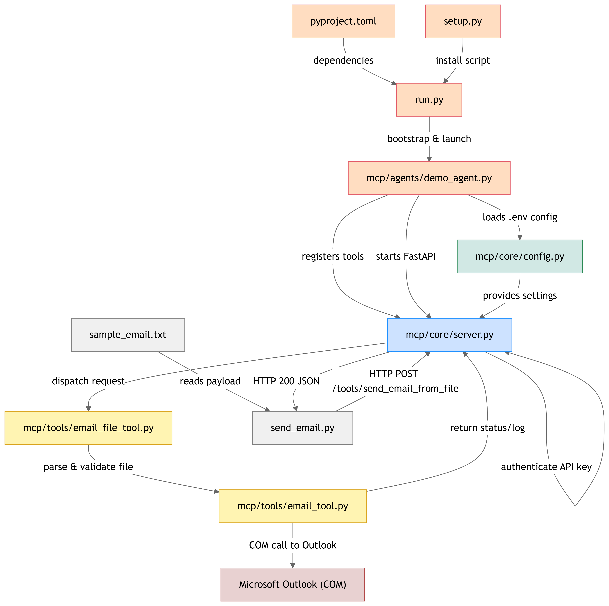

# MCP Agent Demo

A demonstration of a Multi-Component Protocol (MCP) agent system that provides email automation capabilities using Microsoft Outlook.

## Overview

This project implements an MCP (Multi-Component Protocol) agent system that can:

- Automatically start and manage Microsoft Outlook
- Send emails with attachments
- Handle CC and BCC recipients
- Provide detailed logging and error handling

## Prerequisites

- Python 3.9 or higher
- Microsoft Outlook installed
- Windows operating system (for Outlook integration)

## Installation

1. Clone the repository:

```bash
git clone <repository-url>
cd mcp-agent-poc
```

2.Create and activate a virtual environment:

```bash
python -m venv .venv
source .venv/bin/activate  # On Windows: .venv\Scripts\activate
```

3.Install the package in development mode:

```bash
pip install -e .
```

## Configuration

Create a `.env` file in the project root with the following settings:

```env
# Demo Agent settings
DEMO_AGENT_PORT=8000
DEMO_AGENT_API_KEY=your_api_key_here

# Outlook settings
OUTLOOK_PATH="C:\Program Files\Microsoft Office\root\Office16\OUTLOOK.EXE"
```

## Project Structure

```text
mcp-agent-poc/
├── mcp/
│   ├── core/
│   │   ├── __init__.py
│   │   ├── config.py      # Configuration settings
│   │   └── server.py      # FastAPI server implementation
│   ├── tools/
│   │   ├── __init__.py
│   │   ├── email_tool.py      # Email sending functionality
│   │   └── email_file_tool.py # Email file handling
│   └── agents/
│       ├── __init__.py
│       └── demo_agent.py      # Demo agent implementation
├── setup.py
├── pyproject.toml
├── run.py
└── send_email.py
```

## Project Flow Chart



## Usage

### Starting the MCP Agent

```bash
python run.py
```

This will start the MCP server on the configured port (default: 8000).

### Sending an Email

1. Create an email file (e.g., `sample_email.txt`) with the following format:

```text
TO: recipient@example.com
CC: cc@example.com
BCC: bcc@example.com
SUBJECT: Your Subject Here
BODY: Your email body text here.
ATTACHMENTS:
path/to/attachment1.pdf
path/to/attachment2.docx
```

2.Send the email:

```bash
python send_email.py
```

## Components

### Core Module (`mcp/core/`)

#### Configuration (`config.py`)

- Manages application settings using Pydantic
- Loads configuration from environment variables and `.env` file
- Defines settings for the demo agent and Outlook integration

#### Server (`server.py`)

- Implements a FastAPI-based MCP server
- Provides endpoints for tool execution
- Handles API key authentication
- Includes health check endpoint

### Tools Module (`mcp/tools/`)

#### Email Tool (`email_tool.py`)

- Manages Outlook integration
- Automatically starts Outlook if not running
- Handles email composition and sending
- Supports attachments, CC, and BCC
- Provides detailed logging and error handling

#### Email File Tool (`email_file_tool.py`)

- Parses email files
- Extracts recipients, subject, body, and attachments
- Validates email data before sending

### Agents Module (`mcp/agents/`)

#### Demo Agent (`demo_agent.py`)

- Implements the main agent logic
- Registers and manages tools
- Handles tool execution requests
- Provides error handling and logging

## Error Handling

The system includes comprehensive error handling for:

- Outlook startup failures
- Email composition errors
- File access issues
- API authentication failures
- Invalid email data

## Logging

The system provides detailed logging for:

- Outlook startup process
- Email composition steps
- Tool execution
- Error conditions
- API requests
